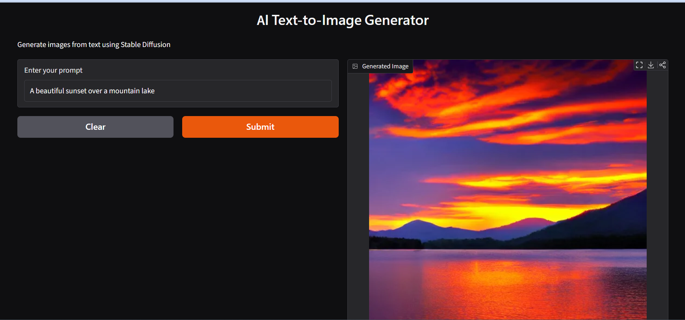

# 🎨 Gen AI Text-to-Image Generator

A Generative AI application that generates images from natural language text prompts using Stable Diffusion and Hugging Face.

## 🖼️ Demo


## 🚀 Features

- Generate images from text prompts
- Stable Diffusion image generation
- Hugging Face authentication
- GPU acceleration using CUDA
- Interactive Gradio interface
- Simple and user-friendly interface

## 🛠️ Technologies Used

- Python
- PyTorch
- Hugging Face Diffusers
- Stable Diffusion
- Hugging Face Hub
- Gradio
- Pillow

## ⚙️ How It Works

User enters a text prompt.

```text
Text Prompt
     ↓
Hugging Face Authentication
     ↓
Stable Diffusion
     ↓
Image Generation
     ↓
Generated Image

▶️ How to Run
1. Clone the repository
git clone https://github.com/YOUR_USERNAME/Gen-AI-Text-to-Image.git
2. Install dependencies
pip install -r requirements.txt
3. Open the notebook

Open:

Gen_AI_Text_to_Image.ipynb
4. Login to Hugging Face

Run:

from huggingface_hub import notebook_login


notebook_login()
5. Run the application

The application uses Gradio to provide an interactive text-to-image interface.

🖼️ Example Prompt
A beautiful sunset over the mountains with a lake,
cinematic lighting, highly detailed
📌 Model

Stable Diffusion v1.5
